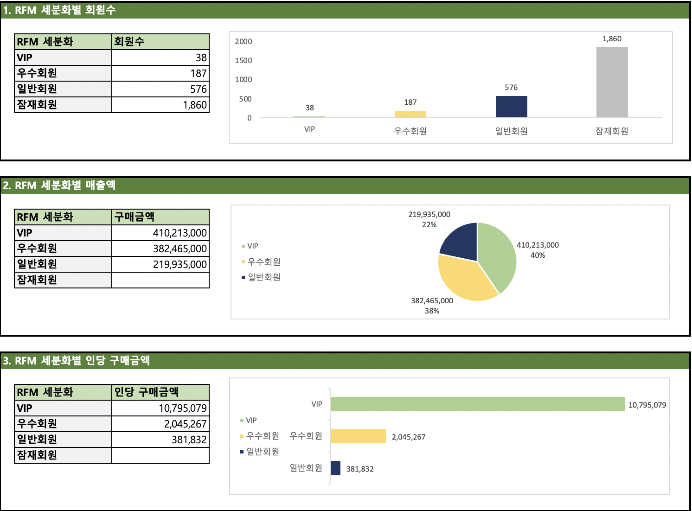

# RFM analysis method
RFM 분석 해보기
 
출처 - [기초데이터분석을 위한 SQL](https://www.boostcourse.org/ds102/lecture/373475?isDesc=false)

## Contents
- RFM 모형은 고객 가치를 분석할 때 사용되는 고객가치 평가모형.

- Recency - 최근성, 얼마나 최근에 구매했는지

- Frequency - 구매 빈도, 얼마나 자주 구매했는지

- Monetary - 구매 금액, 얼마나 많은 금액을 구매했는지

- 사용자 분포를 나타내거나 그룹을 만들어 구매가능성이 높은 고객을 선정할 때 사용할 수 있음.
* Dataset source: [데이터분석을 위한 SQL 강의자료](https://www.boostcourse.org/ds102/lecture/373475?isDesc=false)
* Language used for querying: [MySQL](https://www.mysql.com/), [Excel](https://www.microsoft.com/ko-kr/microsoft-365/excel)
* See my queries [here](https://github.com/gyoungseok/SQL/blob/main/3.RFM_analysis/RFM_analysis.sql)

## 배운 점 & 아쉬운 점

- 데이터 마트
- RFM모형
- SQL을 통해 분석하고, 보고서를 작성 흐름.
 
- 아직까지 조인에 대한 개념을 이해하고, 실제 적용해보는 것이 어려운 것 같다.

